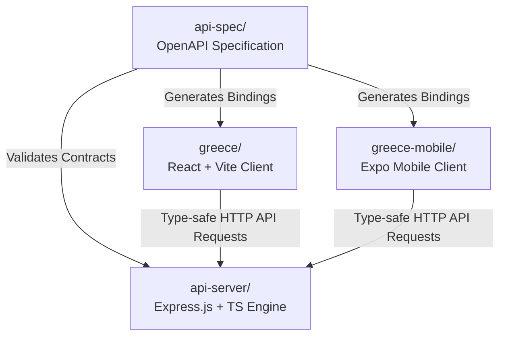

# 
🏛️ GREECE HIEROGLYPHS

  <h3>Egyptian & Hellenic Streetwear E-Commerce Platform</h3>
  
An elegant, premium full-stack storefront celebrating ancient Egyptian & Greek hieroglyphic culture and modern urban streetwear aesthetics. Built with Dark Pyramid.

---

## 🎨 The Brand Vision

Greece Hieroglyphs blends ancient Egyptian & Greek geometry, iconography, and styling with modern urban streetwear aesthetics. The digital store showcases high-quality drops: heavyweight embroidered hoodies, minimalist cropped tops, custom embossed metal chains, and typography tees in both English and Arabic. Built with Dark Pyramid.

---

## 🏛️ System Architecture

Greece Hieroglyphs is structured around a decoupled multi-workspace topology. All modules interact through a generated, type-safe schema layer.

---

## 🧭 Developer Guides Portal

Detailed logs, instructions, and schemas are separated into high-fidelity manuals inside the `/docs` directory. Select a target directory below to explore:

| Destination | Scope | Highlights |
| :--- | :--- | :--- |
| [🛠️ Setup & Run](./docs/SETUP.md) | Local development | Backend, Web, and Expo Mobile setups, CLI scripts, ENV tables, codegen, and troubleshooting logs. |
| [📐 System Architecture](./docs/ARCHITECTURE.md) | Design patterns | Repository mappings, mobile/web layout schemas, data flows, security details, and optimization benchmarks. |
| [🔌 API Reference](./docs/API.md) | Endpoint schemas | Input validation rules, sample payloads, curl scripts, and Swagger UI coordinates. |
| [🚀 Operations & Deploy](./docs/DEPLOYMENT.md) | Production infrastructure | Docker configs, PM2 scripts, cloud hosting rules (Vercel/Render/AWS), Expo EAS builds, and backup strategies. |

---

## 📊 Project Status & Roadmap

### Core Foundation (Completed) ✅
- **React Frontend**: Fully responsive, dark mode-supported storefront (`greece`).
- **Express Backend**: Modular TypeScript API controller (`api-server`).
- **Mobile Storefront**: Native iOS/Android storefront app (`greece-mobile`) using Expo Router.
- **Payment Pipeline**: Stripe API integration with mock-session fallback logic.
- **Autogenerated Types**: Dynamic sync bridge.
- **OpenAPI Schema**: Swagger UI endpoint documentation.

---

## 🎨 Visual Identity Tokens

* **Primary Gold Accent**: `#C89D29` (reflecting warm desert horizons & ancient pharaonic gold)
* **Dark Background Canvas**: `#1A1A1A` (representing basalt stoneworks)
* **Light Card Backgrounds**: `#FFFFFF` (representing polished limestone)

---

**Made with ❤️ for Egyptian & Hellenic Culture. Built with Dark Pyramid (darkpyramid-org).**

